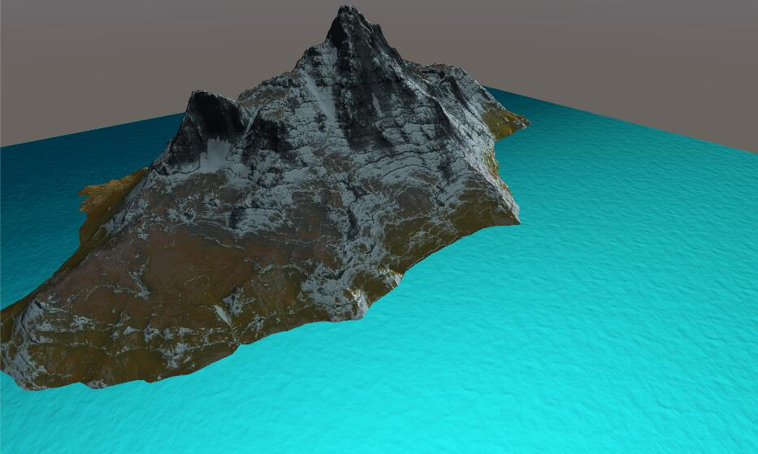
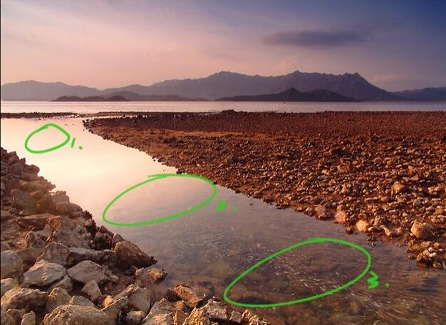
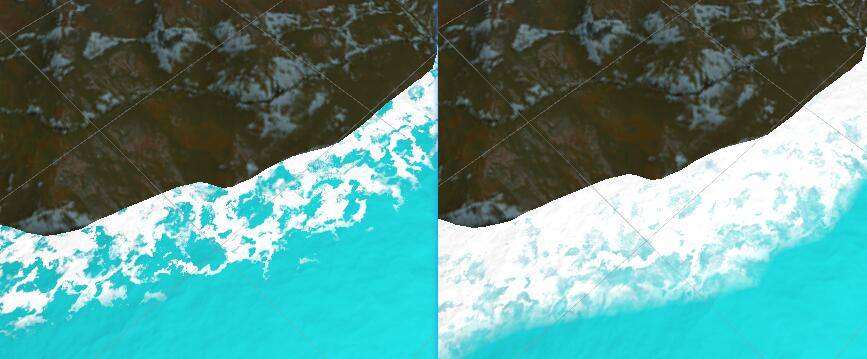
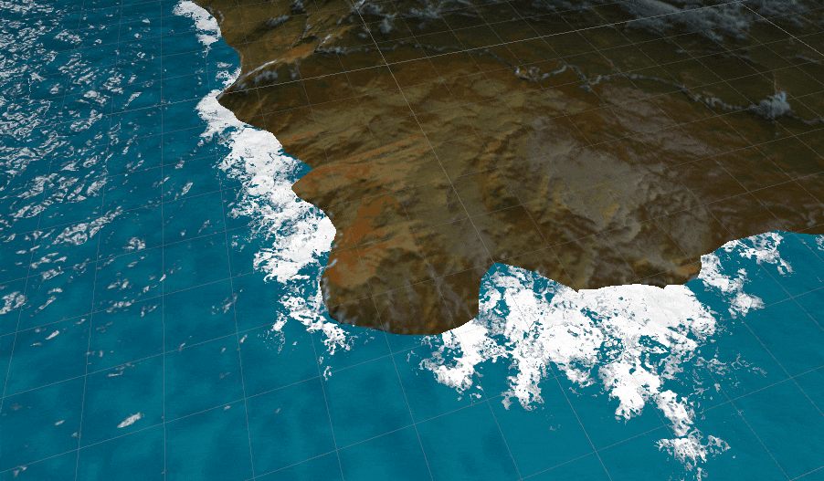
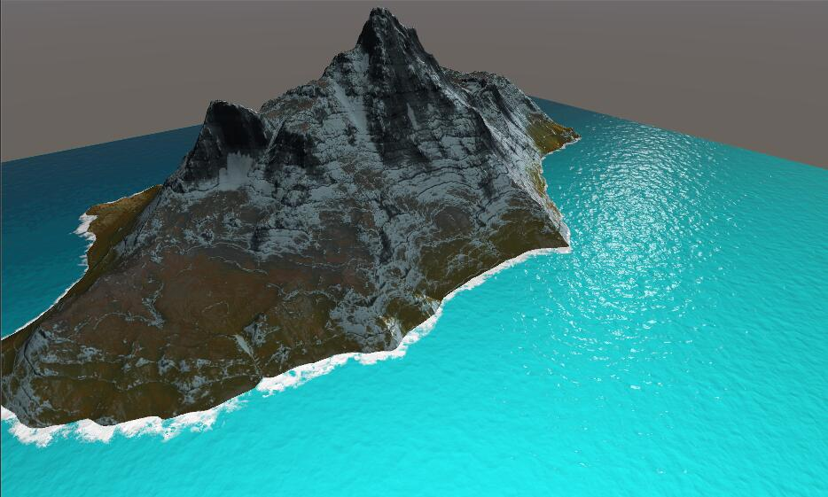
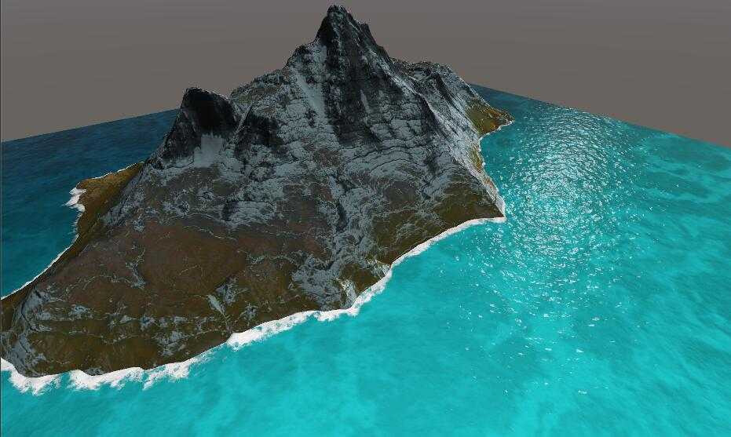
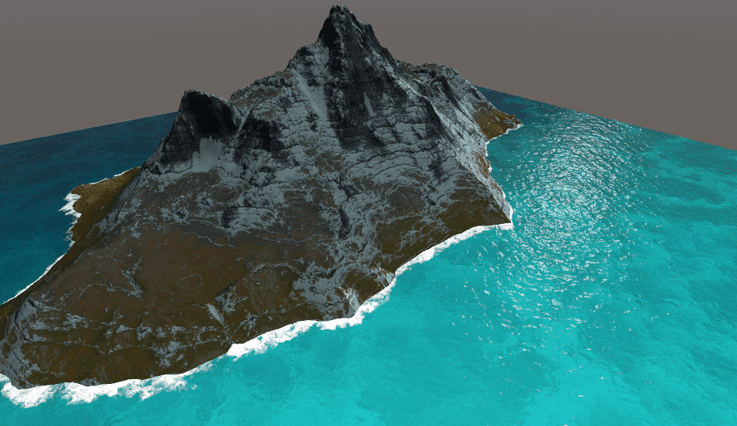
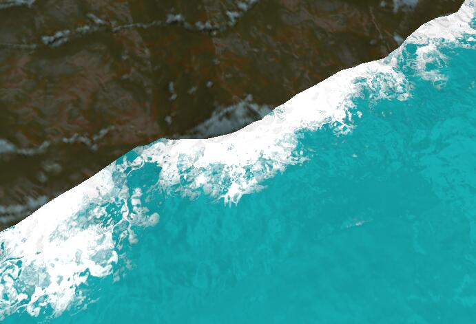
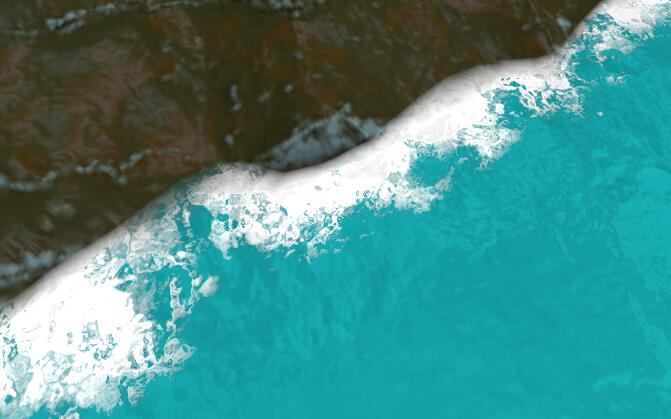

# Simple Water

> 在Unity中使用Shader实现水效果，基本功能有深浅颜色、水面波纹、高光、菲涅尔、边缘泡沫、细节扰动、顶点动画。

最终效果图


使用的贴图就两张

Foam


Noraml


## 1.基本颜色

先来看基本颜色实现。水面一般受深浅影响，颜色会看起来不一样。实现方法就是使用色彩插值。理论上讲可以使用很多颜色插值，简单起见这里只分两个颜色。水面深浅图放在Foam贴图的R通道。Foam贴图RGB通道分别为深浅图、泡沫图、细节图，这样做主要是为了节省贴图，减少采样次数。从0-1对应从浅-深的颜色。参考代码如下：

```c
half degree = tex2D(_Foam,i.uv).r;
half4 diffuse = lerp(_ShalowColor, _DeepColor, degree);
```

此时效果如下：


更改贴图就可以有更丰富的深浅变化，我这里只是简单做了个渐变。与直接采样贴图颜色相比，省了一张RGB贴图，而且美术可以在材质中调节颜色值，而不用去修改贴图。这里uv比例是1:1，贴图大小是512×512。如果要有丰富的深浅变化，对贴图大小和精度要求会更高。

需要注意的是，因为Foam贴图RGB通道存储了不同功能贴图，但面板只有一个UV控制。如果想使用不同的tiling，offset值，需要在shader中处理uv重新tex2D采样，我这里使用了i.uv/_Foam_ST.xy还原了tiling始终为1。

## 2. 水面波纹

水面波纹是水最核心的部分，最常用的做法是使用一张法线贴图做两层uv移动并混合。核心代码如下：

```c
half2 panner1 = ( _Time.y * _WaveParams.xy + i.uv);
half2 panner2 = ( _Time.y * _WaveParams.zw + i.uv);
half3 worldNormal = BlendNormals(UnpackNormal(tex2D( _WaterNormal, panner1)) , UnpackNormal(tex2D(_WaterNormal, panner2)));
worldNormal = lerp(half3(0, 0, 1), worldNormal, _NormalScale);
```

panner1和panner2控制uv偏移。WaveParams的xy和zw分别是水流速度1和速度2._NormalScale控制法线强度。

需要注意的是，原本的法线贴图是存储在切线空间的，法线值需要转换到世界坐标下。关于切线空间转世界空间，可以参考[这篇文章](https://blog.csdn.net/liu_if_else/article/details/73604356)。具体代码如下：

```c
v2f vert (appdata_full v)
{
    ...
    o.worldPos = mul(unity_ObjectToWorld, v.vertex);
    fixed3 worldNormal = UnityObjectToWorldNormal(v.normal);
    fixed3 worldTangent = UnityObjectToWorldDir(v.tangent.xyz);
    fixed tangentSign = v.tangent.w * unity_WorldTransformParams.w;
    fixed3 worldBinormal = cross(worldNormal, worldTangent) * tangentSign;
    o.TW0 = float4(worldTangent.x, worldBinormal.x, worldNormal.x, o.worldPos.x);
    o.TW1 = float4(worldTangent.y, worldBinormal.y, worldNormal.y, o.worldPos.y);
    o.TW2 = float4(worldTangent.z, worldBinormal.z, worldNormal.z, o.worldPos.z);
    ...
    return o;
}
fixed4 frag (v2f i) : SV_Target
{
    ...
    worldNormal = normalize(fixed3(dot(i.TW0.xyz, worldNormal), dot(i.TW1.xyz, worldNormal), dot(i.TW2.xyz, worldNormal)));
    ...
}
```

计算法线值的目的是用来进行光照计算，常见光照模型有Lambert、Blinn-Phong、PBR，也可以自定义光照模型。在这个例子里，高光部分使用了Blinn-Phong光照模型，具体计算后面会讲。Diffuse部分稍作了改变，原本的Diffuse计算需要的是NdotL，这里改为了NdotV，与视角有了一定关系。代码如下：

```c
fixed3 viewDir = normalize(UnityWorldSpaceViewDir(i.worldPos));
float NdotV = saturate(dot(worldNormal,viewDir));
...
diffuse *= NdotV;
```

此时效果如下，可以调整波纹速度、强度和大小（通过tiling值）：



## 3. 水面高光

水面高光能够体现出水波光粼粼的感觉，对于提升水的效果十分重要。这里使用Blinn-Phong的高光公式:
$$
h = normalize(v + l);\\
C_{specular} = C_{light} * specular * pow(max(0, dot(n, h), gloss));
$$
转化为代码如下：

```c
fixed3 halfDir = normalize(worldLightDir + viewDir);
fixed3 specular = _LightColor.rgb * _WaterSpecular * pow(max(0, dot(worldNormal, halfDir)), _WaterGloss);
```

其中_LightColor是光照颜色，waterSpecular是高光整体强度，waterGloss是高光系数。worldLightDir可以是自己定义的vector4，也可以直接获取场景中的主光 _WorldSpaceLightPos0 （局限性：如果场景中光照复杂，比如有多个平行光，则无法指定有效光照是哪个）。

最终输出diffuse.rgb+specular。

此时效果如下：


## 4. 菲涅尔效果

菲涅尔指的是反射/折射与视点角度之间的关系。如果你站在湖边，低头看脚下的水，你会发现水是透明的，反射不是特别强烈；如果你看远处的湖面，你会发现水并不是透明的，而且反射非常强烈。这就是“菲涅尔效应”。



简单的讲，就是视线垂直于表面时，反射较弱，而当视线非垂直表面时，夹角越小，反射越明显。如果你看向一个圆球，那圆球中心的反射较弱，靠近边缘较强。不过这种过度关系被折射率影响。注意，在真实世界中，除了金属之外，其它物质均有不同程度的“菲涅尔效应”。

严格的菲涅尔公式要考虑折射率，这里只是简单根据定义使用NdotV来判断视线与表面的角度关系，NdotV值越接近1说明夹角越小。代码如下：

```c
fixed3 rim = pow(1-saturate(NdotV),_RimPower)*_LightColor * rimIntensity;
```

这个其实也是计算边缘光的公式。

对比效果如下，右边为添加了菲涅尔效果：


## 5. 边缘泡沫

边缘泡沫只产生在水面和其他模型交接的边缘。一般有两种做法，一是用通道图画出边缘。优点是可控性强，性能消耗低。缺点是边缘质量很依赖贴图大小和精度，一旦场景改变需要重制贴图；二是使用深度图直接检测出交接边缘。优点是精度较高，无需美术反复修改贴图。缺点是性能消耗略大（有些低端移动设备不支持渲染深度图或者默认不开启渲染深度图）。这里采用深度图做法。

除了摄像机要开启深度图渲染，shader中需要做以下工作。

声明深度纹理

```c
uniform sampler2D _CameraDepthTexture;
```

获取屏幕位置

```c
o.screenPos = ComputeScreenPos(o.vertex);
```

计算边缘区域

 ```c
half4 screenPos = float4( i.screenPos.xyz , i.screenPos.w);
half eyeDepth = LinearEyeDepth(UNITY_SAMPLE_DEPTH(tex2Dproj(_CameraDepthTexture,UNITY_PROJ_COORD( screenPos ))));
half eyeDepthSubScreenPos = abs( eyeDepth - screenPos.w );
half depthMask = 1-eyeDepthSubScreenPos + _FoamDepth;
 ```

depthMask就是最终得到的边缘区域图，添加FoamDepth是为了控制边缘区域的范围大小。


有了边缘区域接下来就是要让边缘显示为泡沫形状。最简单的做法就是使用泡沫通道乘以遮罩然后对水颜色和泡沫颜色进行插值。参考代码如下：

```c
half3 foam = tex2D(_Foam,i.uv);
float temp_output = ( saturate( (foam.g * depthMask - _FoamFactor) );
diffuse = lerp( diffuse , _FoamColor, temp_output);
```

使用FoamFactor是为了让泡沫细节更多。如下图，左边有FoamFactor影响,右边没有。



以上做法泡沫显得比较单调，考虑使用uv动画让泡沫移动，我直接做了两层泡沫。

```c
half3 foam1 = tex2D(_Foam,i.uv);
half3 foam2 = tex2D(_Foam, _Time.y * _FoamOffset.xy + i.uv);
float temp_output = ( saturate( (foam1.g + foam2.g ) * depthMask - _FoamFactor));
```

此时效果：


可以看到此时边缘十分均匀。可以使用噪声图让边缘不规则点，这里没有增加贴图直接使用了泡沫贴图，也就是depthMask = depthMask * water.g。之前提到过可以处理uv重新采样，这里的water可以是：

```c
half3 water = tex2D(_Foam,i.uv/_Foam_ST.xy);
```

效果如下：


一般来说水面会有一定的扰动，依然是对uv做处理。

```c
half3 foam1 = tex2D(_Foam,i.uv + worldNormal.xy*_FoamOffset.w);
half3 foam2 = tex2D(_Foam, _Time.y * _FoamOffset.xy + i.uv + worldNormal.xy*_FoamOffset.w);
```

Foamoffset.w是扰动因子，更改后效果如下：



此时整体效果：



## 6. 细节扰动

目前已经实现了海的基础效果，然而海面颜色单一缺乏细节。之前说过细节贴图放在Foam的B通道里，只有灰度，需要再加一个颜色属性。修改diffuse的颜色与细节颜色混合：

```c
half4 detail = tex2D(_Foam,i.uv/_Foam_ST.xy).b * _DetailColor;
diffuse.rgb = fixed3(diffuse.rgb * (NdotV + detail.rgb) * 0.5);
```

此时效果：



现在细节只是一层不动的颜色贴图，在这基础上添加扰动，让它更像海水的状态：

```c
half2 detailpanner = (i.uv/_Foam_ST.xy + worldNormal.xy*_WaterWave);
half4 detail = tex2D(_Foam,i.uv/_Foam_ST.xy).b * _DetailColor;
```


## 7. 顶点动画

顶点动画要求模型需要有一定顶点数量，顶点数量越多动画显示效果越好，当然性能消耗也提高了。首先将原来的plane替换为有几万顶点的mesh。代码很简单，只是在顶点着色器中计算下顶点偏移：

```c
float time = _Time.y * _Speed;
float waveValue = sin(time + v.vertex.x *_Frequency)* _Amplitude;
v.vertex.xyz = float3(v.vertex.x, v.vertex.y + waveValue, v.vertex.z);
```

speed是移动速度，Frequency是频率，Amplitude是幅度。



之前一直用的是Opaque不透明渲染，可以看到边缘比较生硬：



考虑使用半透明渲染改善（性能消耗加大）：

```
half alpha = saturate(eyeDepthSubScreenPos-_AlphaWidth);
fixed4 col = fixed4( diffuse + specular + rim ,alpha);
```

AlphaWidth用来控制半透宽度，改善后效果如下：



## 总结

- 制作shader时需要将功能进行拆解，想清楚每一个效果如何去实现。实现基本功能后可以继续迭代，直到做出满意的效果。

- 功能迭代不是毫无顺序的，从基础功能开始，有些功能的前置计算在上个功能中可以得到。性能消耗较大的功能尽量放在后面考虑。比如以上功能进行组合可以变成5个分档：

2. 【Opaque】基础颜色+法线波纹+高光+菲涅尔
3. 【Opaque】基础颜色+法线波纹+高光+菲涅尔+边缘泡沫
4. 【Opaque】基础颜色+法线波纹+高光+菲涅尔+边缘泡沫+细节扰动
5. 【Transparent】基础颜色+法线波纹+高光+菲涅尔+边缘泡沫+细节扰动+顶点动画+边缘透明

- 在制作时有意识的控制贴图及参数的使用，注意shader的易用性。


 